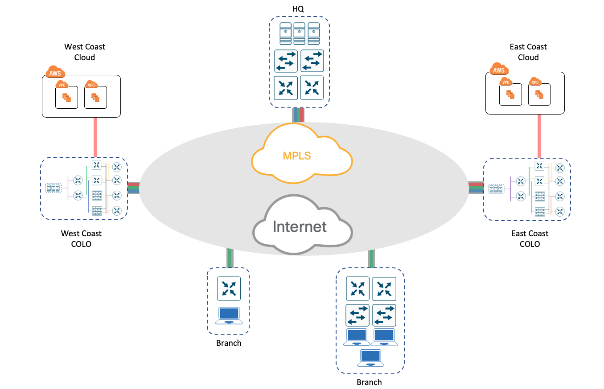
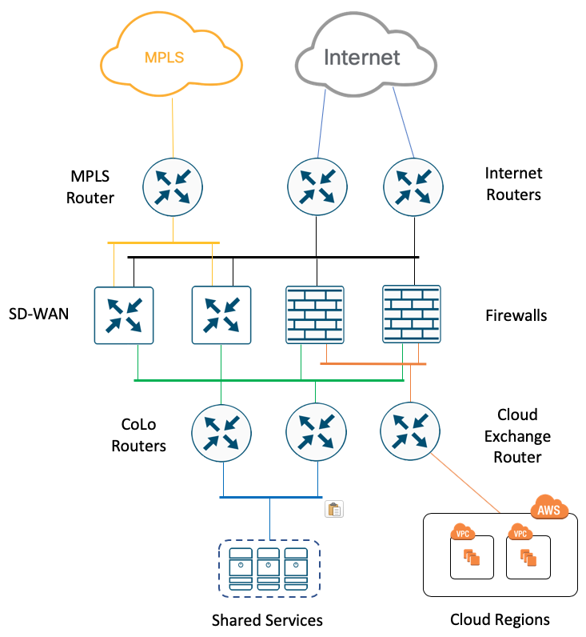
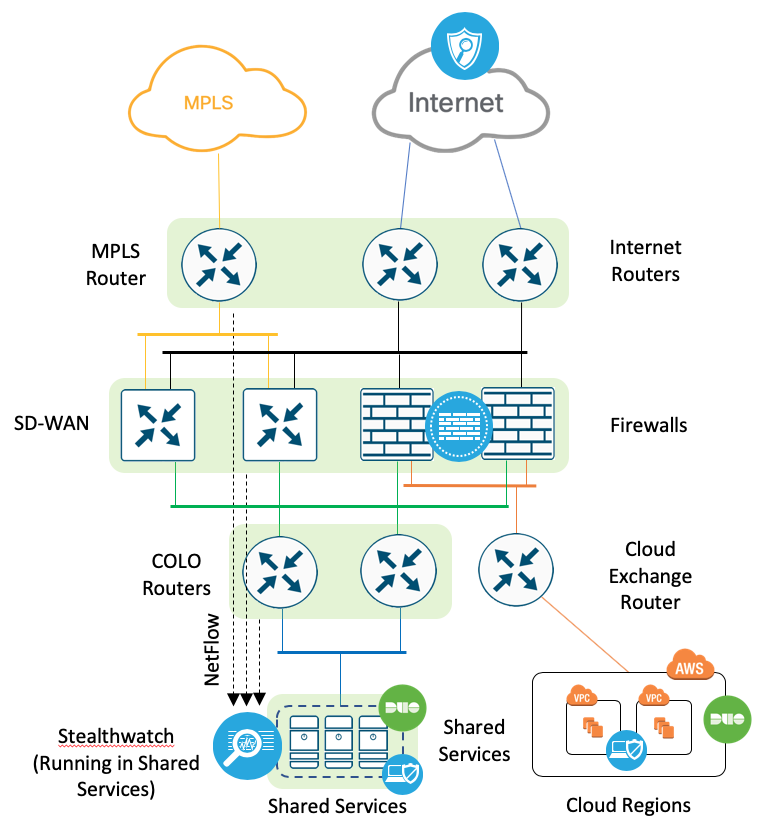
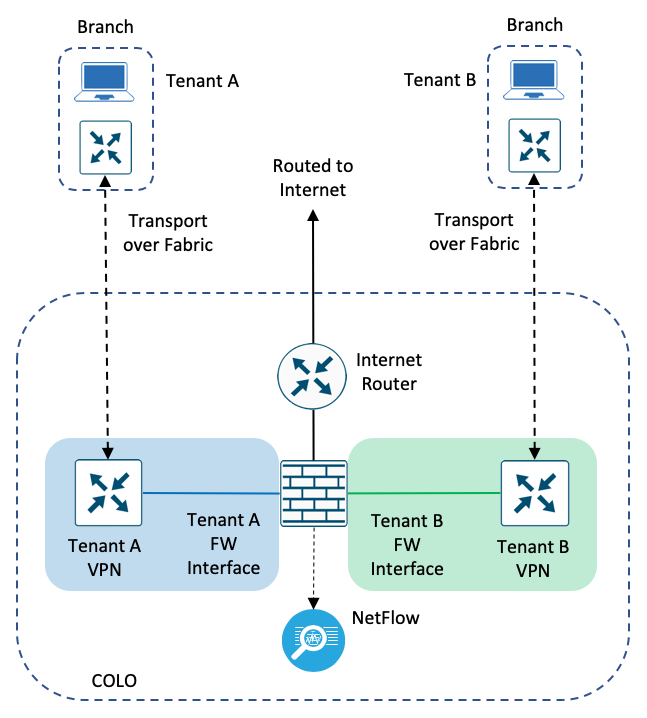
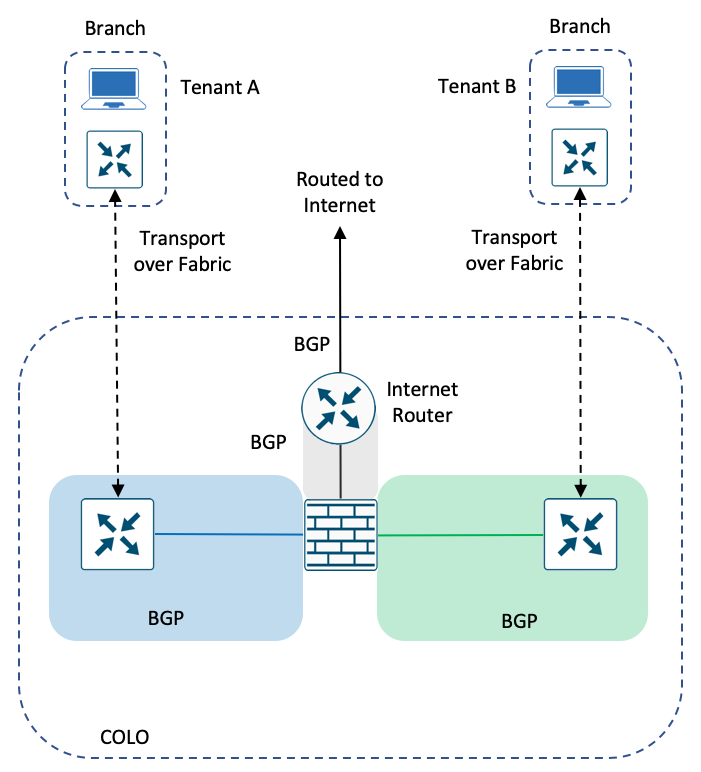
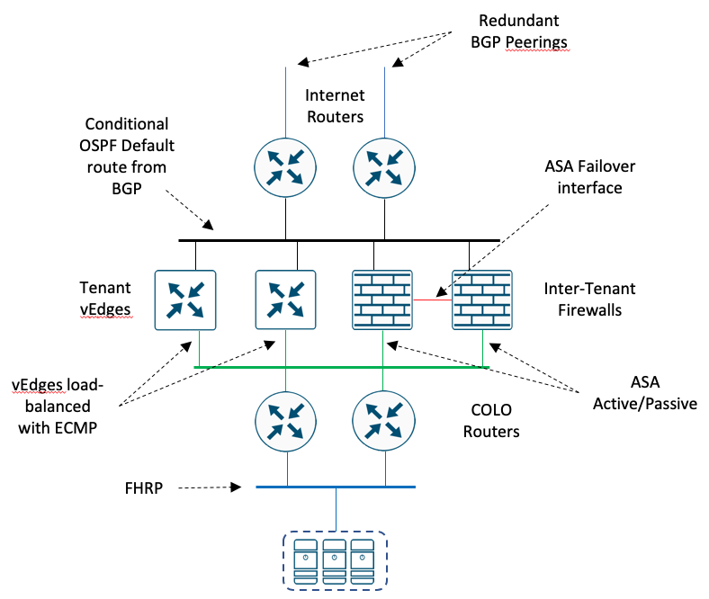

# PS-CRN Architecture

## Fabric Overview

The SD-WAN fabric is anchored in East and West CoLos that provide peering, Internet access, and Cloud connectivity.  Since
CoLos are built for high-availability, have abundant choices of Internet Service Providers, and are generally geographically
close to Cloud regions, they are a cost-effective alternative to similar capabilities located on-prem.  Connectivity to
headquarters and branch sites are then provided via more cost effective means such as broadband services.

The PS-CRN fabric is fully multi-tenant providing policy enforcement and inspection at the CoLo sites.  Policy enforcement
and inspection is also performed at ingress/egress to/from the Internet to comply with TIC requirements.

Connectivity to Cloud resources is provided through the Cloud Exchange at the CoLos.  This provides high-bandwidth,
low-latency connectivity to provide policy enforcement and inspection between and within Cloud regions.

The extension of the SD-WAN fabric to headquarters and branch sites is provided over the commodity Internet, private
transport, or both to provide transport diversity.

Elements included in this version:
* SD-WAN Overlay connecting HQ, branches, and Cloud
* SD-WAN fabric anchored at East and WEST COLOs for redundancy
* Multiple tenants with policy enforcement in between
* Connection to cloud via COLOs
* Diverse transport over Internet and MPLS circuits

## Colo Network Stack

The PS-CRN architecture can be implemented as with either Physical or Virtual Network Functions or a combination of the two to
provide the optimal mix of flexibility, performance, and cost.  At the first level of the CoLo architecture are the Internet
 and private transport routers.  

The second level of network functions terminate the SD-WAN fabric (vEdge) and performs policy enforcement between tenants
and to/from transport networks.  SD-WAN termination can either be provided with vEdge or cEdge.  Policy enforcement
and traffic inspection can be performed with with either ASA or FTD.  However, the pluggable nature of this architecture
provides the ability to either supplement or replace network functions with those from a 3rd party.

The Internet Routers and the Outside interface of Tenant Firewalls peer and exchange routes using OSPF on the
Outside Peering Network in Area 0.  The vEdge Transport interfaces are also on this network to provide transit over the
Commodity Internet.  The vEdge Tenant interfaces and the Firewall Tenant interfaces exchange routes via OSPF over the
Inside Peering Networks (one per tenant), but are each a part of their own OSPF Area.

The third layer of the PS-CRN architecture provides access to the protected resource.  Cloud regions are connected
through the Colo Cloud Exchange providing either direct routed access through the firewall or SD-WAN extension for
end-to-end encryption and visibility.  The colo routers provide access to resources  located within the CoLo that provide
Shared Services to those sites (physical and Cloud) connected to the SD-WAN.  When the CoLo routers are present, they
exchange routes with the vEdge Tenant interfaces and the Firewall Tenant interfaces
on the aforementioned Inside Peering Network.

* Internet Routers peer with Service Providers and other Peers
* Cloud Exchange Routers connect to AWS, Azure, GCE, etc. through the COLO
* MPLS Router provides path diversity over private network
* Tenant vEdges terminate the SD-WAN multi-tenant fabric
* Inter-Tenant Firewalls enforce policy outside<->tenant and tenant<->tenant
* COLO Routers route traffic within Shared Services node

## Colo Security Stack

* Security Visibility:
    * Stealthwatch
* Automated Threat Intelligence Protection:
    * FirePower: IDS/IPS
    * End-Point Security: AMP
* Security Services:
    * DUO
    * Umbrella

## Colo Tenant Traffic Flow

The PS-CRN is a multi-tenant fabric that provides policy enforcement and inspection between tenants and from tenants
to the Commodity Internet.  Policy enforcement is provided by the firewalls.  Intra-Tenant traffic is contained within
the SD-WAN VPN.  To leave the Tenant VPN/VRF, the traffic needs to egress the vEdge and pass through the firewall.
Since the firewall learns routes from each of the SD-WAN VPN segments, it can route that traffic directly to that
after enforcing policy.  The traffic then ingresses the vEdge into the destination tenant's VPN.  Return traffic follows
the same path in the opposite direction.

## Colo Routing Protocols

The Internet Routers exchange routes with peers and service providers via BGP.  To reduce complexity and configuration
burden, internal route exchange is performed via OSPF.  Outside peering is done in area 0, while tenant routes are
contained in OSPF Areas.

## Colo High Availability

### Internet Routers
High availability is provided via HA-pairs of network functions.  The Internet routers has separate BGP sessions to
upstream providers.  They inject a default route into the OSPF Area 0 session on the Outside Peering network.  When both
routers are operational, ECMP is used to load-balance outgoing connections to the Internet.  When a router or BGP
session fails, the default route from that BGP session is no longer injects and that routers is no longer used.  All
traffic then fails over to the remaining router.

### Firewalls
High availabilty at the firewall is provided by a pair of active/passive ASA firewalls.  In an active/passive configuration,
only one firewall has the primary interfaces and forms OSPF sessions.  When the primary firewall fails, either from
total system failuer or the failure of a monitors interfaces, it transitions to secondary and the previously secondary
transitions to primary.

### vEdges
Like the Internet Routers, the vEdges are deployed in an active/active pair.  Both vEdges inject their routes into the
VPN-specific OSPF Area on the appropriate Inside Peering network.  ECMP is used to load-balance traffic across the
to vEdges.

## Hardware Stack

All CoLo functions are provided in a single hardware stack.  The switching fabric is provided by a pair of Catalyst
9500s.  A pair of Cloud Services Platforms are used to provide VNF capacity.  Physical Network functions are added
to the stack when need for high-bandwidth applications.  Finally, a Cisco HyperFlex provides a  hyper-converged
compute and storage platform for running Shared Services in the CoLo.

## Colo TIC Services
* Packet Filtering (FTD)
* Content Filtering (FTD)
* IDPS (FTD)
* Monitoring (Stealth Watch)
* Secure Comms (SD-WAN)

## Use Cases:
- RTBH
- App RTBH
- Inter-VPN Policy
- Cloud OnRamp for SaaS
- Regionalized Routing Optimization
- Hub-and-Spoke Routing
- DIA

## References
* [Cisco CVD: SW-WAN Design Guide](https://www.cisco.com/c/dam/en/us/td/docs/solutions/CVD/SDWAN/CVD-SD-WAN-Design-2018OCT.pdf)
* [Cisco CVD: DW-WAN Deployment Guide](https://www.cisco.com/c/dam/en/us/td/docs/solutions/CVD/SDWAN/CVD-SD-WAN-Deployment-2018OCT.pdf)
* [TIC Reference Architecture V2.2](https://www.dhs.gov/sites/default/files/publications/TIC_Ref_Arch_v2.2_2017.pdf)
* [CVDng](https://wwwin-github.cisco.com/ciscops/cidr/blob/master/cvdng.md)
* [Design Requirements](requirements.md)