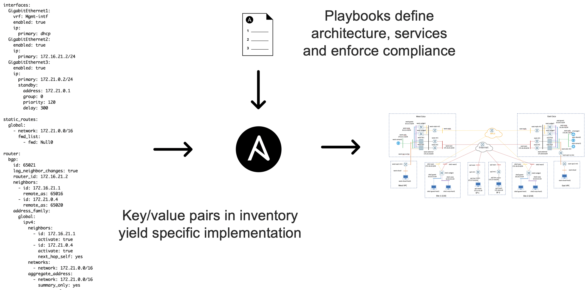
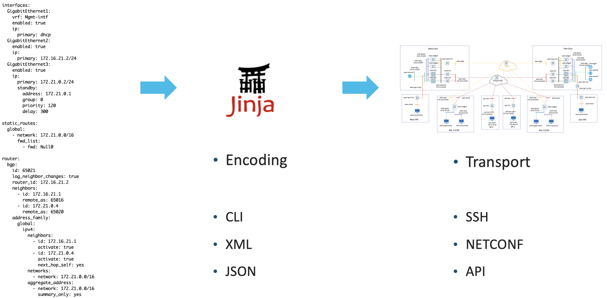

# Automation

## Inventory-Driven Configuration</h2>

## Data-Driven Automation</h2>

## Roles Used</h2>
### ansible-viptela
* Infrastructure agnostic deployment of SD-WAN control plane]
* Provision and configure SD-WAN edge
* Full template lifecycle (import, export, add, delete, modify, attach, detach)
* Full policy lifecycle (import, export, add, delete, modify, activate, deactivate)

### ansible-virl
* Topology lifecycle (Dynamically generate, launch, clean)
* Dynamic inventory

### ansible-pyats
* Run a command and return structured output
* Diff with command output of previous command

## Testbed Bring-Up Sequence
* Create topology
* License VNFs
* Configure SD-WAN control plane
* Provision SD-WAN edges
* Import templates
* Attach templates
* Import policy
* Attach policy
> ~15min to bring up a fully operational SD-WAN fabric