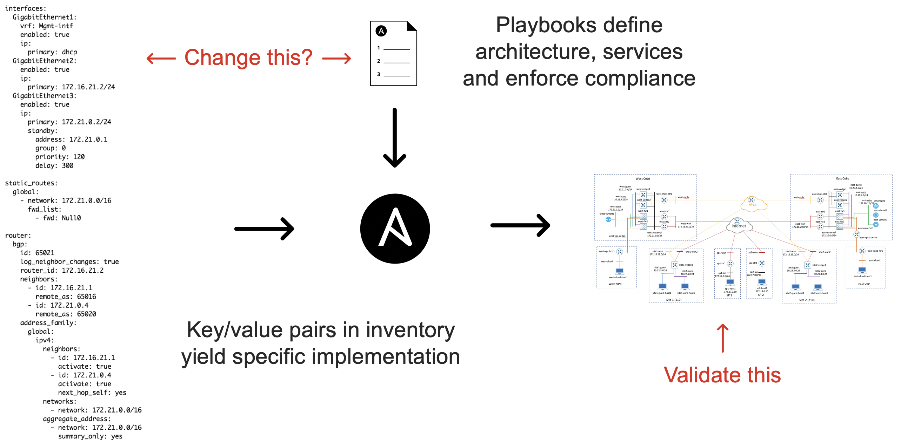
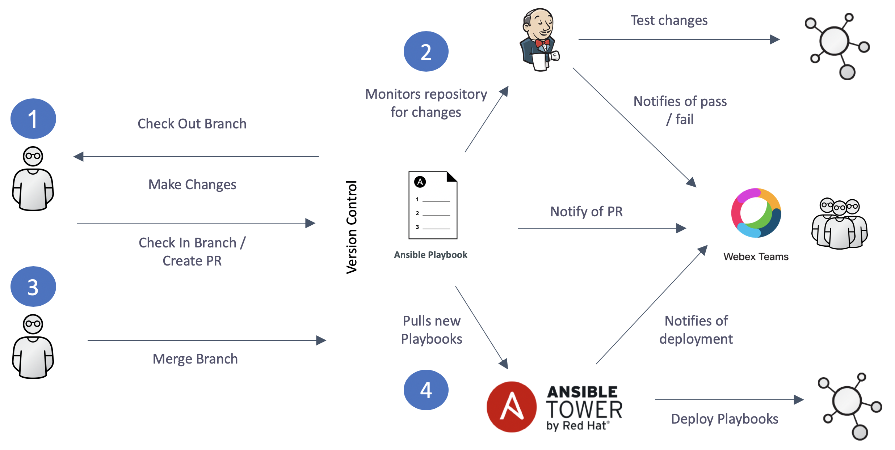

# Testing

## What can we test?
* Automation Code
* Configuration
* Software/Firmware
* Connectivity
* Throughput

## Inventory-Driven Configuration

## Network CI Workflow

## Jenkins
* Jenkinsfile defines (most) everything about the tests
* Launches tests in a docker container for consistent environment
* Loads OS dependencies and Python dependencies (requirements.txt)
* Different Jenkinsfiles for different type of tests (e.g, full, partial, use-case specific)
* VIRL environment with static session ID per environment
* Resource locking
* Speed Kills – Lot’s of retries

## Validation
### `check-sdwan.yml`
* Performs tests of SD-WAN to verify both connectivity and policy
* Uses vmanage_nping for testing

### `check-network.yml`
* Performs connectivity tests of the underlay
* Uses pyATS to perform automated “stare-and-compare” of routing protocols